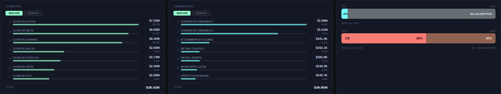

# PayCaddy — Main Dashboard de Operaciones
## Documentación Técnica y Funcional

| | |
|---|---|
| **Versión** | 1.0 |
| **Estado** | In Progress |
| **Fecha** | Abril 2026 |
| **Assignee** | Juan Diego Galvez T · Teofilo Asprilla · Gabs Jaen |
| **Proyecto** | Definiciones Ops |
| **Prioridad** | High |

---

## 1. Resumen Ejecutivo

El Main Dashboard de Operaciones de PayCaddy es un tablero construido en Power BI Desktop con visuales HTML/CSS personalizados. Su objetivo es concentrar las métricas operacionales clave de la plataforma de tarjetas prepago, permitiendo al equipo de operaciones monitorear en tiempo real el volumen de transacciones, el comportamiento de las tarjetas, los canales de uso y los ingresos.


*Vista general del Main Dashboard de Operaciones (datos anonimizados)*

El dashboard está diseñado para ser extendible, performante y visualmente alineado con la paleta corporativa de PayCaddy. Toda la lógica de negocio reside en DAX y Power Query, mientras que el HTML se utiliza exclusivamente para presentación.

---

## 2. Stack Tecnológico

| Componente | Herramienta / Versión | Notas |
|---|---|---|
| BI Tool | Power BI Desktop | Versión más reciente |
| Visuales HTML | HTML Content v1.6.0 (Daniel Marsh-Patrick) | Marketplace · Sin CDN ni fetch externos |
| ETL | Power Query (M) | Transformaciones en origen |
| Métricas | DAX | Tabla exclusiva llamada `Medidas` |
| Fuente de datos | Minsait (SQL Server) | 4 tablas de transacciones + Incomings |
| Tablas auxiliares | SharePoint de Operaciones | Product Tracking · ISO Country Codes |

### Restricción crítica — HTML Content v1.6.0

- No permite llamadas CDN ni `fetch` externos
- Todo JavaScript debe ir inline dentro de la medida DAX
- Las librerías JS solo pueden usarse si están embebidas completamente

---

## 3. Modelo de Datos

### 3.1 Modelo Relacional

```
epigram.client  →  apiClient.user  →  apiClient.wallet  →  apiClient.card  →  Transacciones
```

### 3.2 Tablas del Modelo

| Tabla | Esquema | Tipo | Descripción |
|---|---|---|---|
| `client` | epigram | Dimensión | Datos del cliente PayCaddy |
| `user` | apiClient | Dimensión | Usuario vinculado al cliente |
| `wallet` | apiClient | Dimensión | Billetera del usuario |
| `card` | apiClient | Dimensión/Hechos | Tarjeta asociada a la billetera |
| `Transacciones` | Medidas (UNION) | Hechos | UNION de 4 tablas Minsait |
| `Incomings` | Medidas (UNION) | Hechos | UNION de IncomingIn e IncomingOut |
| `Calendar_Transacciones` | Medidas | Calendario | Fechas para transacciones e incomings |
| `Calendar_MasterData` | Medidas | Calendario | Fechas para entidades (user, wallet, card) |
| `Medidas` | — | Técnica | Tabla exclusiva para medidas DAX |
| `Product Tracking` | SharePoint | Auxiliar | Nombres de productos de tarjetas |

### 3.3 Query de Extracción — Transacciones

La tabla `Transacciones` consolida 4 fuentes Minsait mediante `UNION ALL`:

- `PeticionAutorizacion` — autorizaciones de transacciones
- `ComunicacionAutorizacion` — comunicaciones de autorización
- `Devolucion` — devoluciones procesadas
- `Anulacion` — anulaciones de transacciones
- `MoneySendIn` — transferencias entrantes

**Filtros clave aplicados en Power Query:**
- `Resc39CodigoAccion = '00'` para autorizaciones aprobadas
- `BDateUtcCreate` como columna de fecha principal
- `Source` como columna discriminadora del tipo de transacción

---

## 4. Medidas DAX

### 4.1 Medidas Base

Todas las medidas residen en la tabla `Medidas`. Las medidas base son el punto de partida del modelo de métricas:

| Nombre | KPI | Tipo | Filtros clave |
|---|---|---|---|
| `Vol Auth` | Volumen Autorizado | SUM(monto) | Source=Autorizaciones, Resc39='00' |
| `MoneySend` | MoneySend IN | COUNTROWS | Source=MoneySendIN |
| `DevAnu` | Devoluciones/Anulaciones | COUNTROWS | Source IN {Devoluciones, Anulaciones} |
| `Inc In` | Incomings IN | SUM(Amount) | Source=IncomingIn |
| `Inc Out` | Incomings OUT | SUM(Amount) | Source=IncomingOut |

### 4.2 Patrón de Medidas Derivadas

Por cada medida base se generan **8 medidas derivadas** (5 KPIs × 8 = **40 medidas totales**):

| Sufijo | Descripción | Patrón DAX |
|---|---|---|
| `[KPI] Hoy` | Valor del día actual | `CALCULATE([KPI], FILTER(ALL(Calendar), Date=TODAY()))` |
| `[KPI] Día Anterior` | Valor del día anterior | `CALCULATE([KPI], FILTER(ALL(Calendar), Date=TODAY()-1))` |
| `[KPI] Var Día Abs` | Diferencia absoluta vs ayer | `[KPI Hoy] - [KPI Día Anterior]` |
| `[KPI] Var Día %` | Variación % vs ayer | `DIVIDE([Var Día Abs], [KPI Día Anterior])` |
| `[KPI] Mes Actual` | Acumulado mes en curso | `CALCULATE([KPI], FILTER(ALL(Calendar), Year/Month actuales))` |
| `[KPI] Mes Anterior` | Acumulado mes anterior completo | `CALCULATE([KPI], FILTER(ALL(Calendar), Year/Month del mes anterior))` |
| `[KPI] Var Mes Abs` | Diferencia absoluta vs mes ant. | `[KPI Mes Actual] - [KPI Mes Anterior]` |
| `[KPI] Var Mes %` | Variación % vs mes anterior | `DIVIDE([Var Mes Abs], [KPI Mes Anterior])` |

**Principios de diseño:**
- `ALL(Calendar_Transacciones)` con filtro explícito sobre `TODAY()` garantiza independencia del contexto de slicers
- `EDATE(TODAY(), -1)` para calcular el mes anterior completo
- `DIVIDE()` con tercer argumento `0` para evitar errores de división por cero
- `COALESCE([medida], 0)` para prevenir BLANKs en visuales de tendencia

---

## 5. Visuales HTML

### 5.1 Arquitectura

Cada visual HTML es una medida DAX en la tabla `Medidas` que devuelve un string HTML completo. Se arrastra al campo `Values` del HTML Content visual.

**Patrón de construcción:**

```dax
VAR _css  = "...todos los estilos en una sola línea..."
VAR _js   = "...JS concatenado con & ..."
VAR _body = "<div>..." & _valor & "...</div>"
RETURN
    "<!DOCTYPE html><html><head><style>" & _css & "</style></head><body>"
  & _body
  & "<script>" & _js & "</script></body></html>"
```

**Reglas críticas:**
- Sin comentarios DAX (`--`) dentro del bloque de construcción del string
- Sin saltos de línea dobles entre variables
- Sin caracteres Unicode (`▲ ▼`) en strings que llegan al JS — usar `+` / `-`
- `CM` (mes actual) se inyecta como número entero: `var CM=4;`
- `SD` (sparkline data) se inyecta con comillas simples: `var SD='0|0|...'`
- Comillas dobles dentro del JS generado: usar `String.fromCharCode(34)`

### 5.2 Inventario de Visuals

| Visual | Medida DAX | Descripción | Alto |
|---|---|---|---|
| KPI Cards (×5) | `HTML KPI Vol Auth`, etc. | Valor mes, hoy, delta día y mes | ~160px |
| Cards Tarjetas | `HTML Cards Tarjetas` | Total, creadas hoy, sparkline, tabla productos | ~480px |
| Canal & Origen | `HTML Canal Origen` | Barras ATM/POS y CB/DOM con % y volumen | ~120px |
| Trendline | `HTML Trendline` | 4 series, doble eje Y, reactivo a slicers | ~220px |

### 5.3 Paleta Corporativa

| Token | HEX | Uso |
|---|---|---|
| Brand Dark | `#1F2223` | Fondo de todos los visuals |
| Seafoam Green | `#95F9CB` | Accent principal · Indicadores positivos |
| Teal | `#0AAFB0` | Links · Valores Vol. Auto. · Punto activo sparkline |
| Dark Green | `#085041` | Texto sobre fondo seafoam |
| Light Blue | `#C7F3FD` | Badge MoneySend · Sparkline Cards Tarjetas |
| Coral | `#F5C4B3` | Badge Dev/Anu |
| Dom Grey | `#D3D1C7` | Badge DOM |
| Dove Grey | `#666E71` | Textos secundarios · Eje Y trendline |
| Up (verde) | `#0DA86E` / `rgba(13,168,110,.15)` | Delta positivo |
| Down (rojo) | `#D94F48` / `rgba(217,79,72,.15)` | Delta negativo |

---

## 6. Descripción Funcional

### 6.1 KPI Cards

5 cards con las métricas operacionales principales del mes en curso. Cada card muestra valor acumulado del mes, valor del día, y dos comparativos (vs. día anterior y vs. mes anterior) con pill de color.


*KPI Cards — 6 métricas con valor acumulado, delta día y delta mes*

**Lógica de color de deltas:**
- `Vol Auth`, `MoneySend`, `Inc In`: movimiento positivo = verde (favorable)
- `DevAnu`, `Inc Out`: movimiento positivo = rojo (desfavorable)

### 6.2 Cards Tarjetas

Visual vertical con total acumulado de tarjetas activas (suma por producto, excluyendo `Cancel` y `PendingAck`), tarjetas creadas hoy y en el mes con variaciones, sparkline mensual con puntos y montos, y tabla de desglose por producto.


*Trendline (4 series, doble eje Y) y Cards Tarjetas con sparkline y tabla de productos*

### 6.3 Canal & Origen

Dos barras apiladas horizontales mostrando Volumen Autorizado segmentado por canal (ATM vs POS) y origen geográfico (Cross-Border vs Doméstico). Porcentaje encima de la barra, nombre + volumen debajo.



*Clientes Top 7, Comercios Top 7 y desglose Canal & Origen*

### 6.4 Trendline

Gráfico de tendencia temporal con 4 series. Muestra evolución diaria de Monto Autorizado, Volumen Autorizado, Monto Dev/Anu y MoneySend. Reactivo a slicers mediante `ALLSELECTED(Calendar_Transacciones)`.

---

## 7. Guía de Mantenimiento

### 7.1 Agregar un nuevo KPI

1. Copiar las 8 medidas derivadas de cualquier KPI existente
2. Reemplazar la referencia a la medida base en Hoy, Día Anterior, Mes Actual y Mes Anterior
3. Renombrar el prefijo en las 8 medidas
4. Crear medida HTML basada en la plantilla de KPI Cards

### 7.2 Cambiar el tema de color

Todos los colores están hardcoded en `VAR _css`. Usar `Ctrl+H` en el editor DAX para buscar y reemplazar el HEX en cada medida.

### 7.3 Errores comunes y soluciones

| Error | Causa | Solución |
|---|---|---|
| `Unexpected token '<'` | HTML partido en múltiples líneas | Separar en `VAR _css`, `VAR _js`, `VAR _body` y ensamblar en RETURN |
| `Invalid or unexpected token` | Unicode (`▲▼`) o comentarios `--` que llegan al script | Usar `+`/`-` en lugar de `▲▼`. Eliminar todos los `--` |
| `DAX Text vs Integer` | Columna texto comparada con entero | Usar literales de texto o `VALUE()` |
| `Variable already exists` | Variable definida dos veces | Verificar duplicados al pegar código nuevo |
| Sparkline vacío | String `_js` corrupto — comillas dobles borradas | Reconstruir con `String.fromCharCode(34)` |

---

## 8. Componentes Pendientes

| Componente | Estado | Descripción |
|---|---|---|
| Top 10 Comercios | Pendiente | Ranking de los 10 comercios con mayor Monto Autorizado |
| Hoja de Detalle de Transacciones | Pendiente | Tabla HTML con Fecha, Username, PAN, Comercio, Card Present, Trx Type, País Adquirente, Monto Auth, Monto Cruzado |

---

## 9. Glosario

| Término | Definición |
|---|---|
| DAX | Data Analysis Expressions. Lenguaje de fórmulas de Power BI |
| HTML Content | Visual del Marketplace que renderiza HTML/CSS/JS en el canvas |
| Minsait | Proveedor de datos de transacciones de tarjetas para PayCaddy |
| Vol Auth | Volumen Autorizado. Suma del monto de transacciones aprobadas |
| DevAnu | Devoluciones y Anulaciones |
| MoneySend | Transferencias de dinero entrantes (MoneySendIN) |
| Inc In / Inc Out | Incomings IN y OUT — entradas y salidas de fondos |
| CB | Cross-Border. País adquirente distinto a Panamá (ISO 591) |
| DOM | Doméstico. País adquirente = Panamá (ISO 591) |
| Sparkline | Mini gráfico de tendencia SVG incrustado en una card |
| Calendar_Transacciones | Tabla de fechas para transacciones e incomings |
| Calendar_MasterData | Tabla de fechas para entidades (user, wallet, card) |

---

*Generado con apoyo de Claude · PayCaddy Operaciones · Abril 2026*
