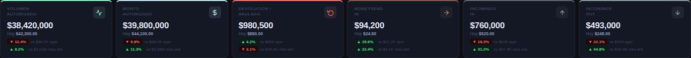
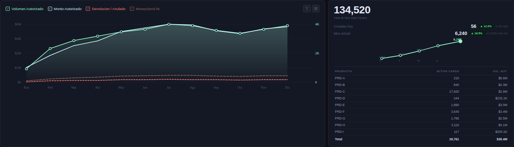

# 📊 Dashboard de Operaciones — PayCaddy

> Rediseño completo del Main Dashboard de Operaciones en Power BI usando visuales HTML/CSS personalizados.

---

## 🚀 Demo

[](https://teoramos05.github.io/Dashboard-Operaciones/visuals/index.html)
[](https://www.notion.so/34e5080a0de48183afe9e7deca202de0)

---

## 📌 Descripción del Proyecto

Rediseño del **Main Dashboard de Operaciones** de una plataforma de tarjetas prepago, migrado de visuales nativos de Power BI a componentes HTML/CSS completamente personalizados, logrando una experiencia visual superior alineada con la identidad corporativa.

### Problema
El dashboard original utilizaba visuales nativos de Power BI con capacidades de personalización limitadas, presentación básica y sin identidad visual corporativa.

### Solución
Rediseño completo usando **HTML Content visual** (Daniel Marsh-Patrick v1.6.0) con toda la lógica en DAX y visualización en HTML/CSS/JS inline.

---

## 🛠️ Stack Tecnológico

| Herramienta | Uso |
|---|---|
| **Power BI Desktop** | Plataforma BI principal |
| **HTML Content v1.6.0** | Renderizado de visuales personalizados |
| **DAX** | Toda la lógica de métricas (tabla `Medidas`) |
| **Power Query (M)** | ETL y transformación de datos |
| **SVG / CSS** | Gráficos y estilos inline |
| **Minsait (SQL Server)** | Fuente de datos transaccional |

---

## 📐 Arquitectura del Modelo de Datos

```
epigram.client → apiClient.user → apiClient.wallet → apiClient.card → Transacciones
```

**Tablas principales:**
- `Transacciones` — UNION de 4 fuentes Minsait (autorizaciones, comunicaciones, devoluciones, anulaciones, MoneySendIN)
- `Incomings` — entradas y salidas de fondos
- `Calendar_Transacciones` — tabla de fechas para transacciones
- `Calendar_MasterData` — tabla de fechas para entidades

---

## 📊 Visuals Implementados

### KPI Cards (×6)
Cards con métricas operacionales: valor del mes, valor hoy, delta vs día anterior y vs mes anterior con pill de color.



### Trendline + Cards Tarjetas
Gráfico de tendencia con 4 series (Volumen Autorizado, Monto Autorizado, Dev/Anu, MoneySend) y panel de tarjetas emitidas con sparkline mensual.



### Clientes · Comercios · Canal & Origen
Rankings por volumen y desglose de canal (ATM/POS) y origen geográfico (Cross-Border/Doméstico).


---

## 🎨 Paleta Corporativa

| Token | HEX | Vista previa |
|---|---|---|
| Brand Dark | `#1F2223` |  |
| Seafoam Green | `#95F9CB` |  |
| Teal | `#0AAFB0` |  |
| Light Blue | `#C7F3FD` |  |
| Coral | `#F97B75` |  |

---

## 🔑 Patrones DAX Clave

### Patrón de medidas derivadas
Por cada KPI base se generan 8 medidas: `Hoy`, `Día Anterior`, `Var Día Abs`, `Var Día %`, `Mes Actual`, `Mes Anterior`, `Var Mes Abs`, `Var Mes %`.

```dax
VAR _css  = "...estilos en una sola línea..."
VAR _js   = "var SD='" & _spark & "'.split('|').map(Number);"
          & "var CM=" & _fCM & ";"
          & "function drawSpark(){...}"
VAR _body = "<div class='ct'>..." & _valor & "...</div>"
RETURN
    "<!DOCTYPE html><html><head><style>" & _css
  & "</style></head><body>" & _body
  & "<script>" & _js & "</script></body></html>"
```

### Restricciones críticas HTML Content v1.6.0
- ❌ Sin CDN ni `fetch` externos — todo JS inline
- ❌ Sin comentarios DAX `--` dentro del string
- ❌ Sin caracteres Unicode `▲▼` en strings que llegan al JS
- ✅ Usar `String.fromCharCode(34)` para comillas dobles en SVG

---

## 📁 Estructura del Repositorio

```
Dashboard-Operaciones/
│
├── README.md                          # Este archivo
├── docs/
│   └── PayCaddy_Dashboard_Docs.md    # Documentación técnica y funcional
│
├── visuals/
│   └── dashboard_demo.html           # Demo interactivo (datos anonimizados)
│
└── images/
    ├── comparativa_antes_despues.png  # Comparativa Antes vs Después
    ├── dash_kpi.png                   # KPI Cards
    ├── dash_mid.png                   # Trendline + Cards Tarjetas
    └── dash_bot.png                   # Clientes + Comercios + Canal
```

---

## 📄 Documentación

La documentación completa del proyecto está disponible en:
- 📘 [Notion — Documentación Técnica y Funcional](https://www.notion.so/34e5080a0de48183afe9e7deca202de0)
- 📄 [`docs/PayCaddy_Dashboard_Docs.md`](docs/PayCaddy_Dashboard_Docs.md)

---

## 👤 Autor

**Teofilo Asprilla**
[](https://github.com/TeoRamos05)

---

## 📌 Notas

> Los datos mostrados en el demo son completamente ficticios y anonimizados. No contienen información real de la empresa.

---

*Power BI · HTML Content · DAX · Rediseño 2026*
